# 🍕 Pizza Sales Report (Jan 2015 – Dec 2015)

**Sources:** SQL analysis in PostgreSQL ([`pizza_sales_queries.sql`](pizza_sales_queries.sql)) and Power BI dashboard ([`PowerBI_Dashboard.md`](PowerBI_Dashboard.md)).

---

## 1. Executive Summary

In 2015 the restaurant earned **817,860.05** from **21,350 orders** and **49,574 pizzas**. The average order is worth **38.31** and contains about **2.32 pizzas**.

- **Friday** is the busiest day; **Sunday** is the slowest.
- **Classic** is the best-selling category (30.03% of pizzas); **Large** is the top size in every category.
- **The Thai Chicken Pizza** earns the most revenue; **The Classic Deluxe Pizza** sells the most and appears in the most orders.
- **The Brie Carre Pizza** is the weakest pizza on revenue, quantity and orders.

---

## 2. Overall KPIs (SQL queries 1–5)

| KPI | Value |
|-----|------:|
| Total Revenue | 817,860.05 |
| Average Order Value | 38.31 |
| Total Pizzas Sold | 49,574 |
| Total Orders | 21,350 |
| Avg Pizzas Per Order | 2.32 |

| Total Revenue | Avg Order Value |
|---|---|
| 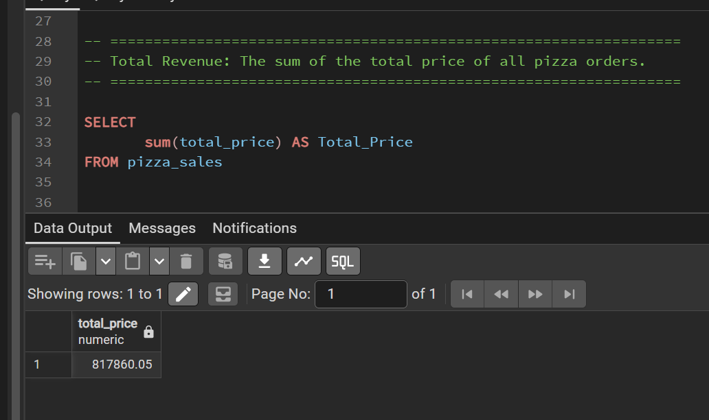 | 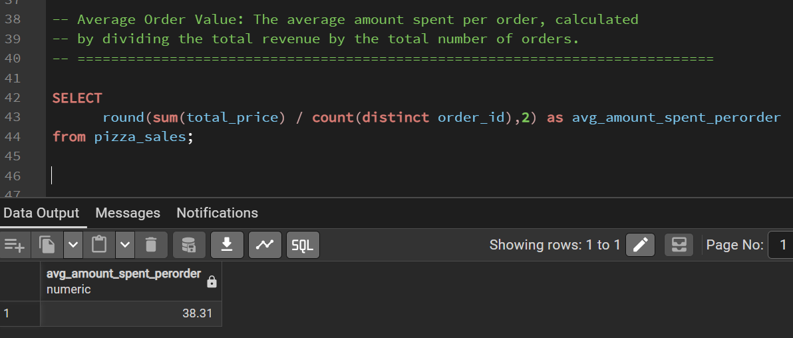 |

| Total Pizzas Sold | Total Orders |
|---|---|
| 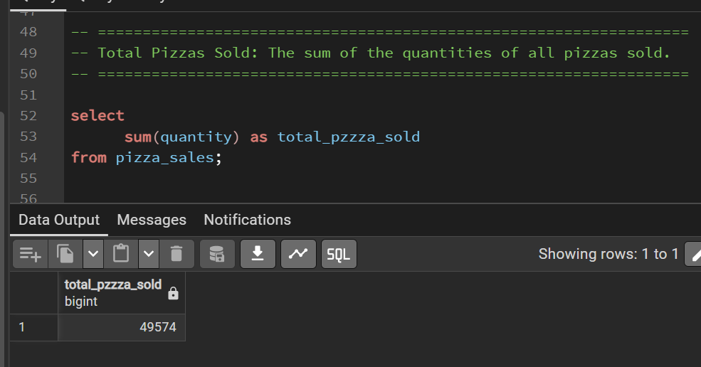 | 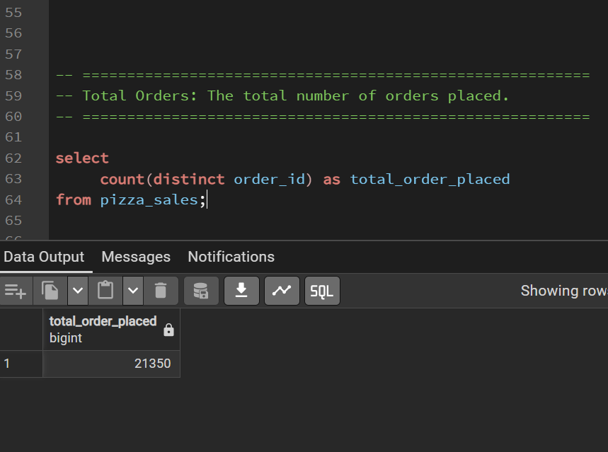 |

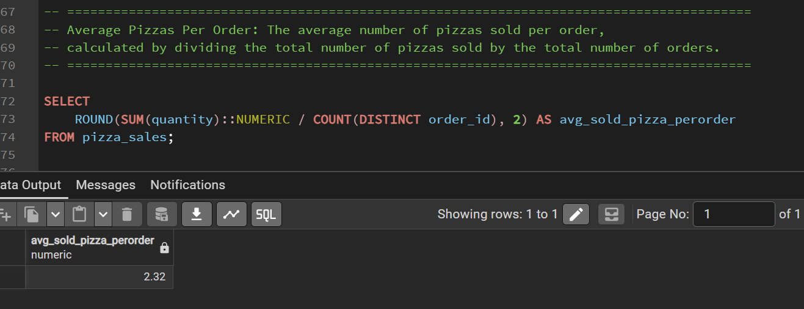

---

## 3. Time Trends (SQL queries 6–7)

### Orders by day of week

| Day | Orders |
|-----|-------:|
| Monday | 2,794 |
| Tuesday | 2,973 |
| Wednesday | 3,024 |
| Thursday | 3,239 |
| **Friday** | **3,538** |
| Saturday | 3,158 |
| Sunday | 2,624 |

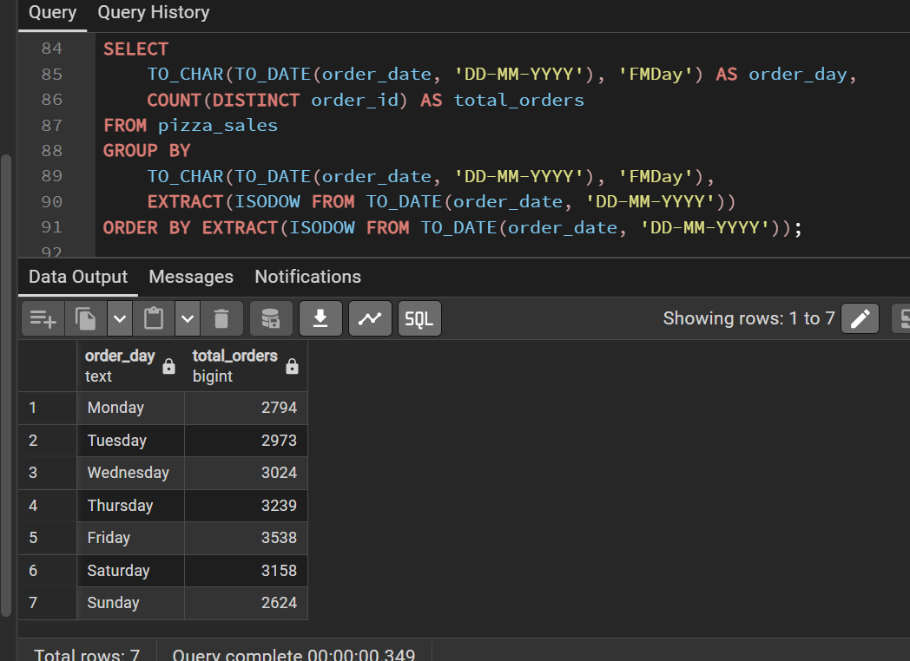

Orders climb from Monday to a Friday peak. The Power BI daily chart confirms Friday as the peak in all four categories.

### Orders by month

| Month | Orders |
|-------|-------:|
| January | 1,845 |
| February | 1,685 |
| March | 1,840 |
| April | 1,799 |
| May | 1,853 |
| June | 1,773 |
| **July** | **1,935** |
| August | 1,841 |

*(September–December were not in the screenshot; add them from the full result.)*

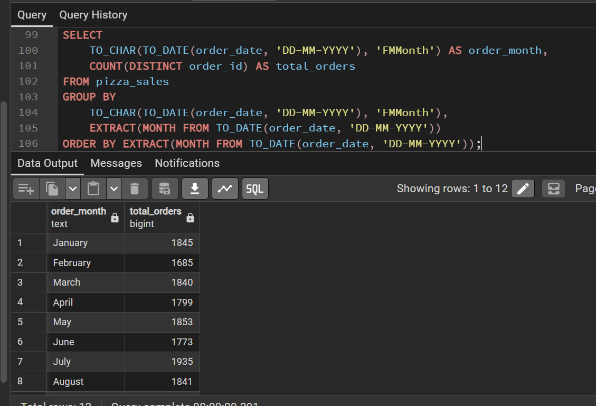

Monthly orders stay in a narrow band (about 1,700–1,950). July is the highest month shown and February the lowest.

---

## 4. Category Performance (SQL queries 8–9 + Power BI Home page)

| Category | Pizzas Sold | % Share | Revenue | Avg Order Value | Orders |
|----------|------------:|--------:|--------:|----------------:|-------:|
| Classic | 14,888 | 30.03% | 220.05K | 20.26 | 10,859 |
| Supreme | 11,987 | 24.18% | 208.20K | 22.92 | 9,085 |
| Veggie | 11,649 | 23.50% | 193.69K | 21.66 | 8,941 |
| Chicken | 11,050 | 22.29% | 195.92K | 22.95 | 8,536 |

*Order counts overlap between categories (one order can mix categories), so they don't add up to 21,350.*

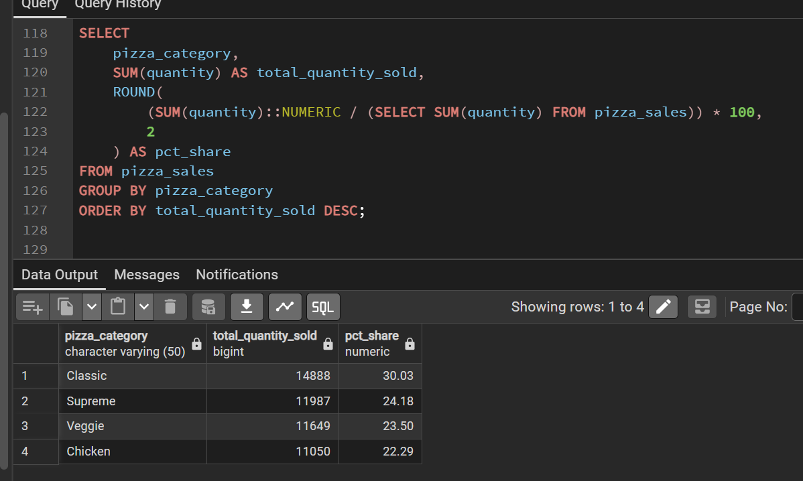

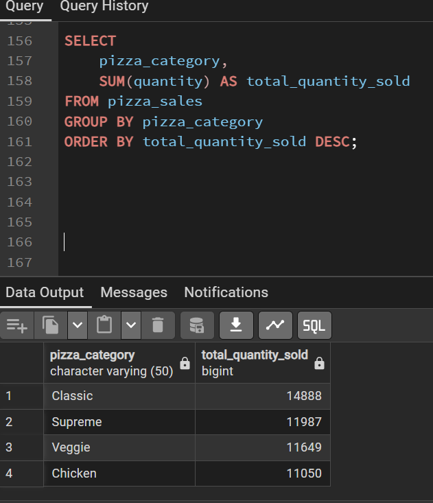

**Size mix (Power BI):** Large leads everywhere — Chicken 52.24%, Classic 33.86%, Supreme 45.27%, Veggie 53.80%. Only Classic sells X-Large (6.4%) and XX-Large.

**Insights**
- Classic wins on volume and total revenue, but has the lowest average order value (20.26).
- Chicken and Supreme customers spend the most per order (about 22.9).

### Dashboard – Home page

| Classic | Chicken |
|---|---|
| 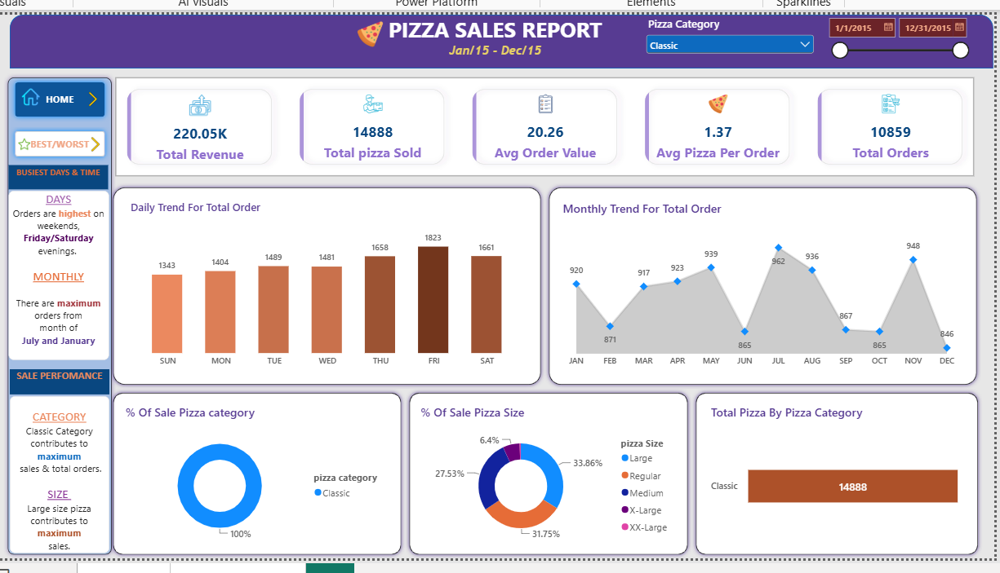 | 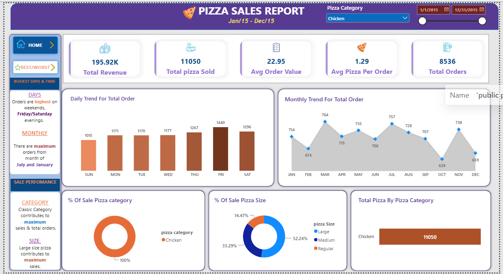 |

| Supreme | Veggie |
|---|---|
| 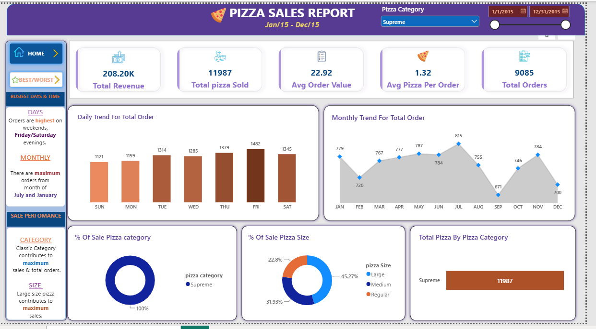 | 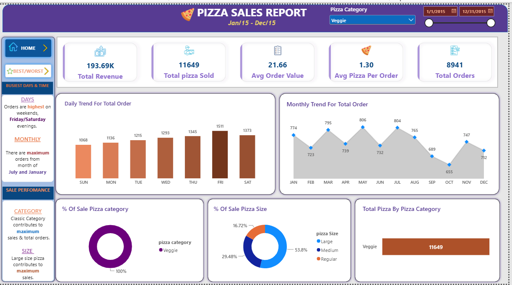 |

---

## 5. Best and Worst Pizzas (SQL queries 10–15)

### Top 5 (all pizzas)

| # | By Revenue | By Quantity | By Orders |
|---|-----------|-------------|-----------|
| 1 | Thai Chicken – 43,434.25 | Classic Deluxe – 2,453 | Classic Deluxe – 2,329 |
| 2 | Barbecue Chicken – 42,768.00 | Barbecue Chicken – 2,432 | Hawaiian – 2,280 |
| 3 | California Chicken – 41,409.50 | Hawaiian – 2,422 | Pepperoni – 2,278 |
| 4 | Classic Deluxe – 38,180.50 | Pepperoni – 2,418 | Barbecue Chicken – 2,273 |
| 5 | Spicy Italian – 34,831.25 | Thai Chicken – 2,371 | Thai Chicken – 2,225 |

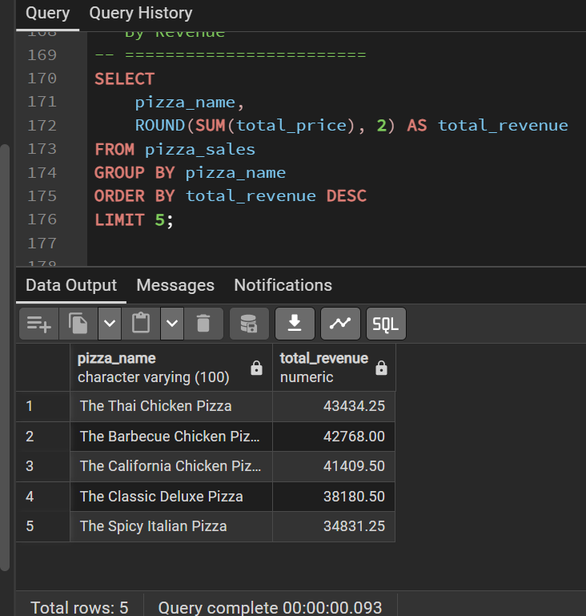
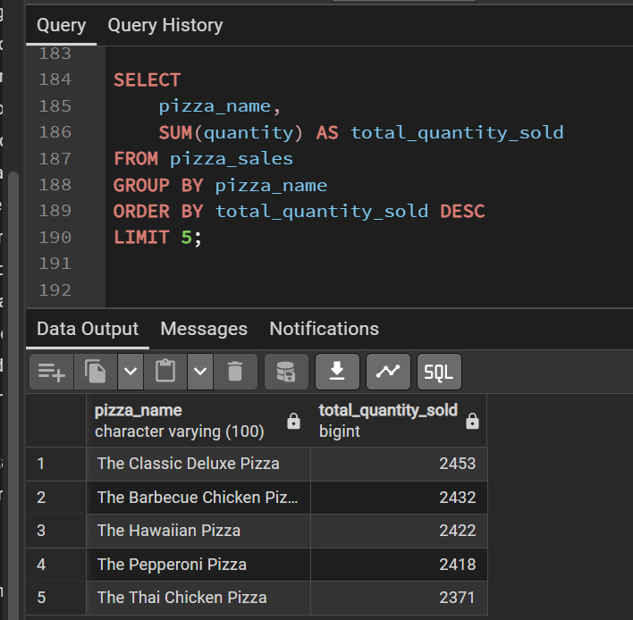
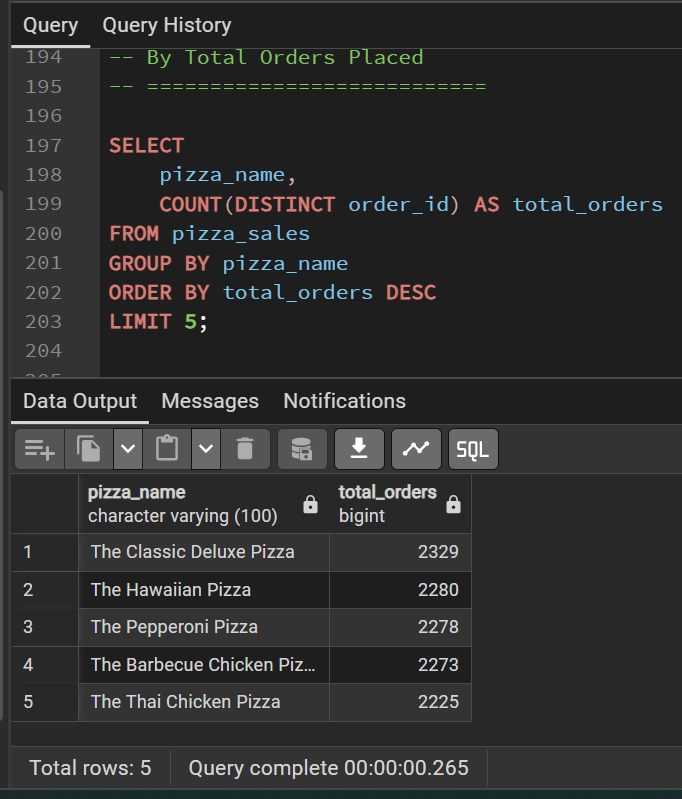

### Bottom 5 (all pizzas)

| # | By Revenue | By Quantity | By Orders |
|---|-----------|-------------|-----------|
| 1 | Brie Carre – 11,588.50 | Brie Carre – 490 | Brie Carre – 480 |
| 2 | Green Garden – 13,955.75 | Mediterranean – 934 | Mediterranean – 912 |
| 3 | Spinach Supreme – 15,277.75 | Calabrese – 937 | Calabrese – 918 |
| 4 | Mediterranean – 15,360.50 | Spinach Supreme – 950 | Spinach Supreme – 918 |
| 5 | Spinach Pesto – 15,596.00 | Soppressata – 961 | Chicken Pesto – 938 |

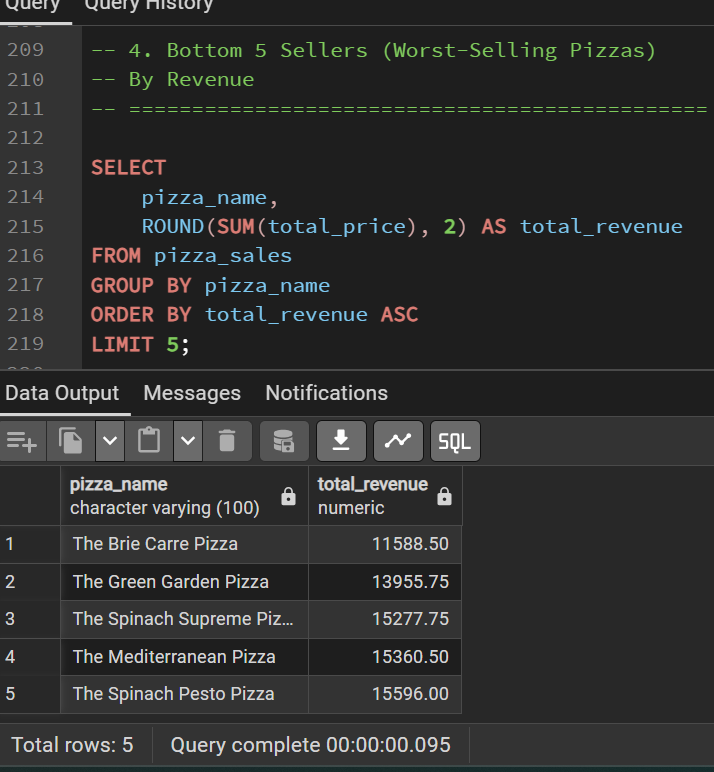
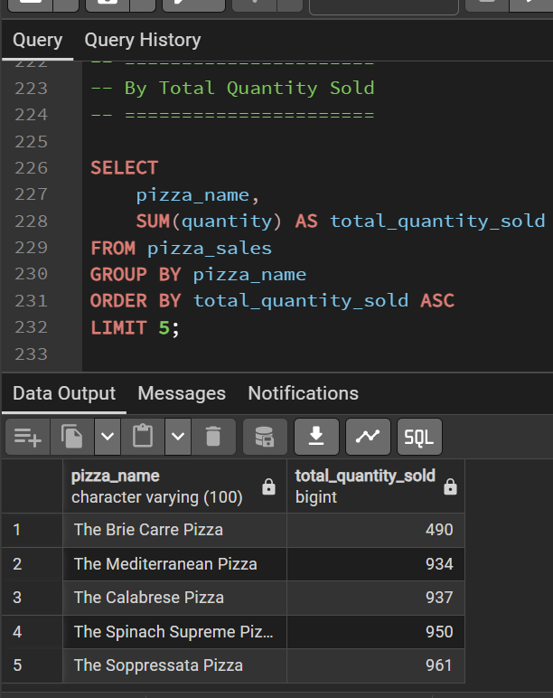
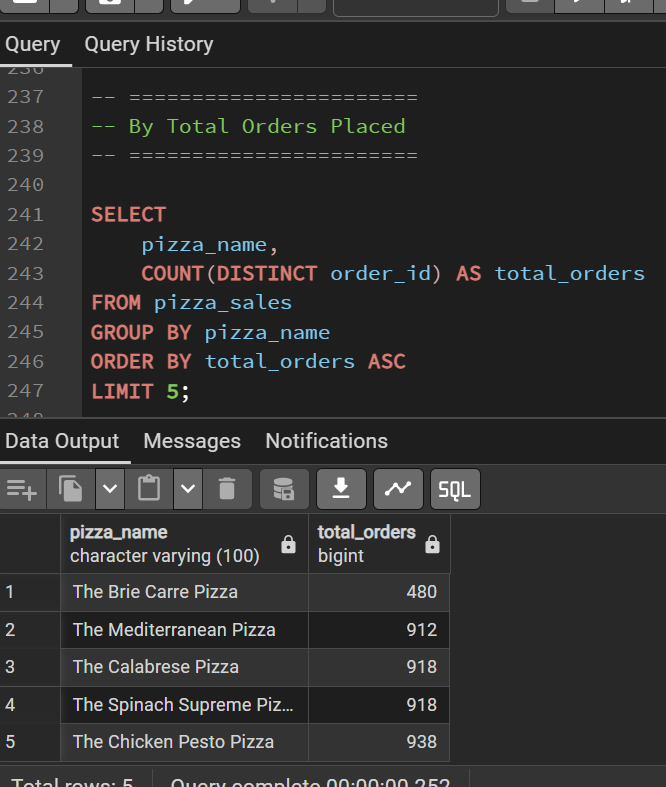

**Insights**
- Thai Chicken earns the most revenue but is only 5th by quantity, so it has a higher price per pizza.
- Classic Deluxe, Hawaiian and Pepperoni bring in the most customers.
- Brie Carre sells roughly half as much as the next-weakest pizza.

### Best and worst by category (Power BI Best/Worst page)

| Category | Best by Revenue | Best by Quantity | Weakest |
|----------|-----------------|------------------|---------|
| Chicken | Thai Chicken (43,434) | Barbecue Chicken (2,432) | Chicken Pesto (16,702 rev · 973 qty) |
| Classic | Classic Deluxe (38,181) | Classic Deluxe (2,453) | Pepperoni, Mushroom, and Peppers (18,835 rev · 1,359 qty) |
| Supreme | Spicy Italian (34,831) | Sicilian (1,938) | Brie Carre (11,588 rev · 490 qty) |
| Veggie | Four Cheese (32,266) | Four Cheese (1,902) | Green Garden (13,956 rev) · Mediterranean (934 qty) |

| Chicken | Classic |
|---|---|
| 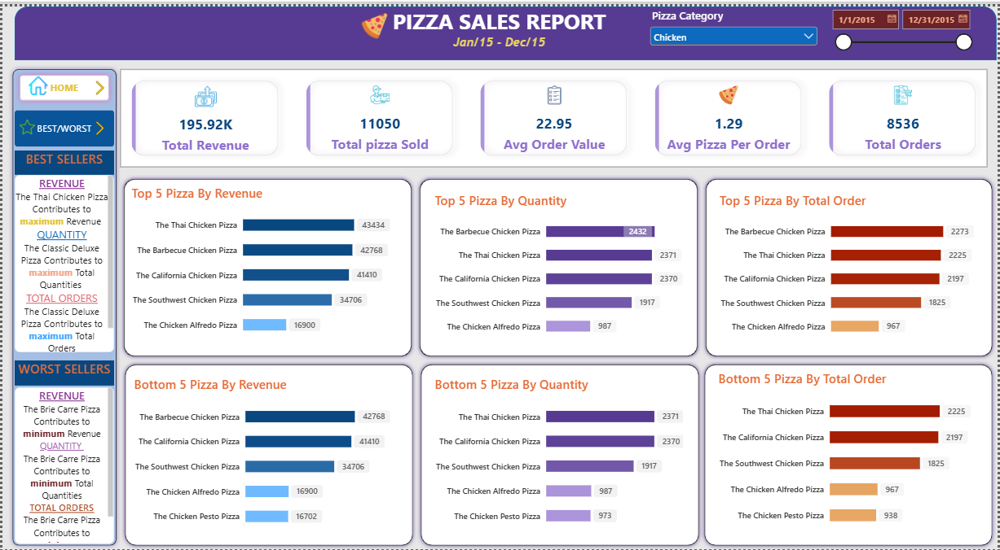 | 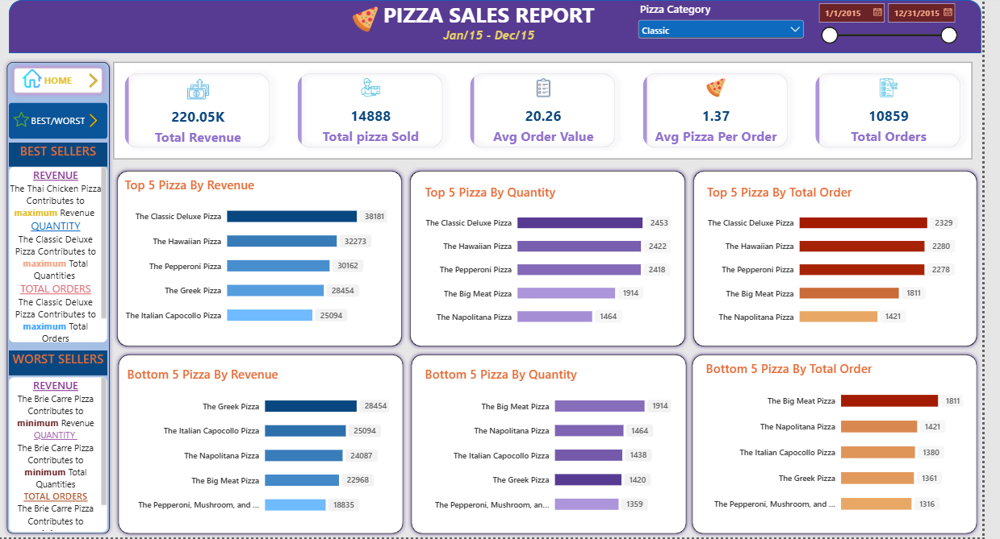 |

| Supreme | Veggie |
|---|---|
| 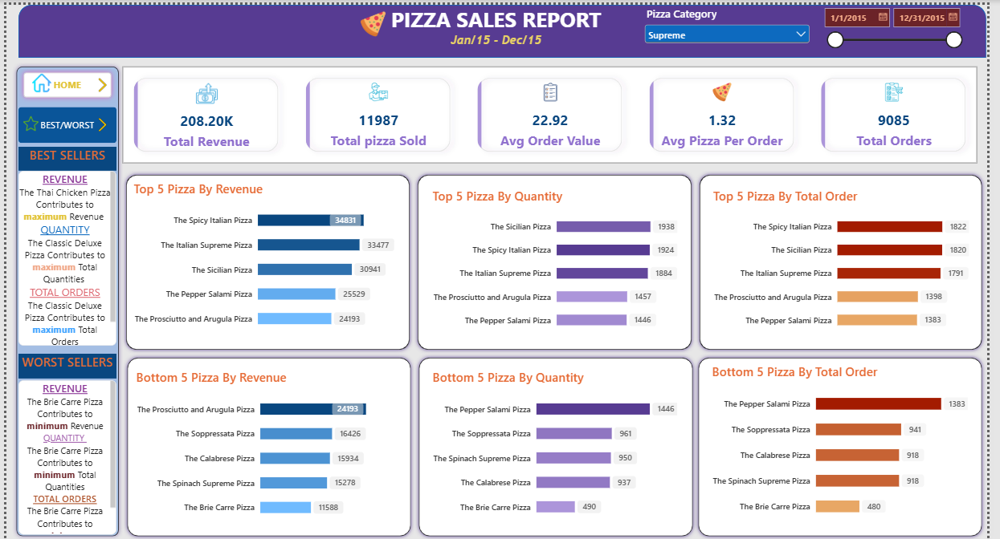 | 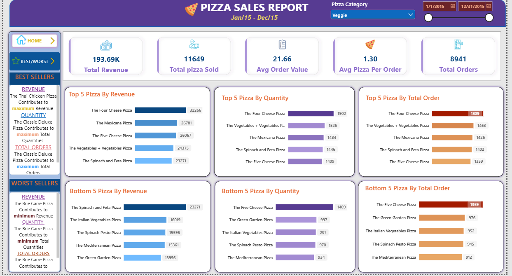 |

---

## 6. Recommendations

1. **Staff and stock for Thursday–Saturday**, especially Friday. Use Sunday/Monday for promotions.
2. **Promote high-revenue pizzas** (Thai, Barbecue and California Chicken; Spicy Italian; Four Cheese).
3. **Keep the volume drivers prominent** — Classic Deluxe, Hawaiian and Pepperoni.
4. **Review The Brie Carre Pizza** (reprice, reformulate or remove), and check Green Garden, Mediterranean and Calabrese.
5. **Push Large sizes and bundles** to raise the average order value (38.31) and pizzas per order (2.32).
6. **Lift Classic's order value** with add-ons or combos, since it has the most orders but the lowest average spend.

## 7. Notes for Review

- The dashboard text says January and July are the busiest months, but May (1,853) beats January (1,845) in the SQL results.
- The left-panel text on the Best/Worst page is static, so it doesn't follow the category filter (for example, it names Brie Carre as the worst on every category page).
- With a category filter, the Bottom 5 charts repeat pizzas from the Top 5 because each category has only 6–8 pizzas.
